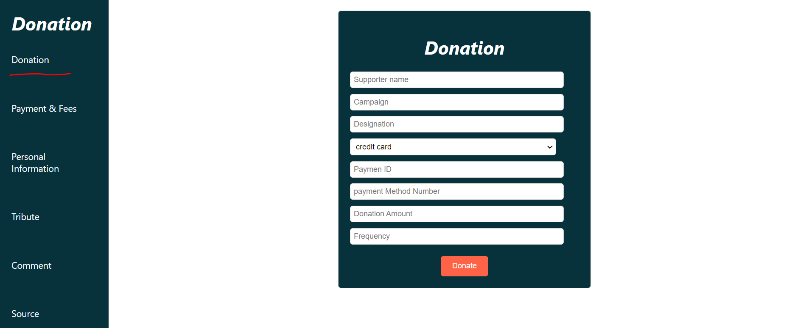
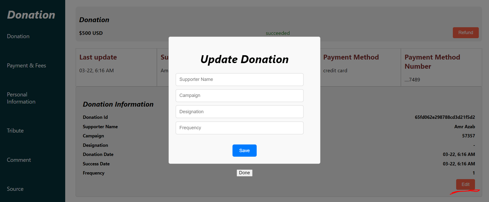

# Donation

⚫ This web enables users to donate, view their donation information, including the time of each donation, and update their donations.
⚫ The project is divided into the client (frontend) and the server (backend).
⚫ I implemented features such as creating donations, viewing, tracking the list of my donations, and updating my donations.
⚫ Technologies : Node, React, MongoDB, TypeScript, and Express.

## Screenshot

Create donation

View and track the list of my donations after create donation

view the donation information after create donation

can update the donation

